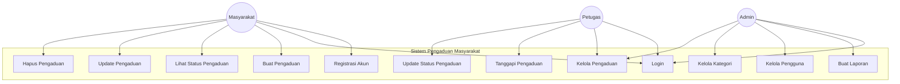
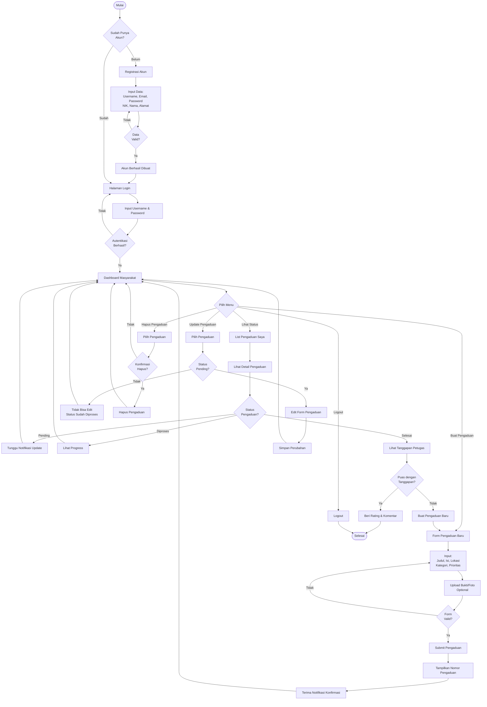
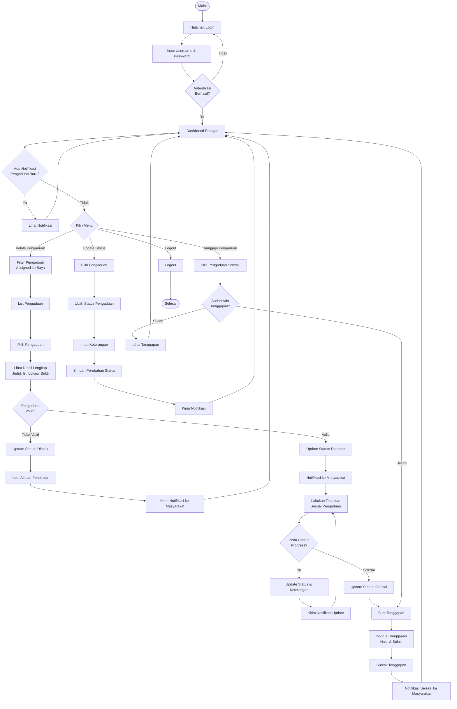
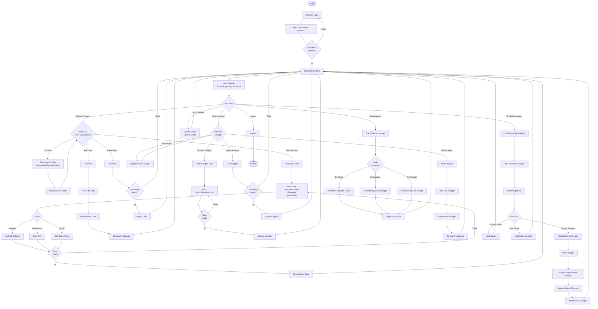
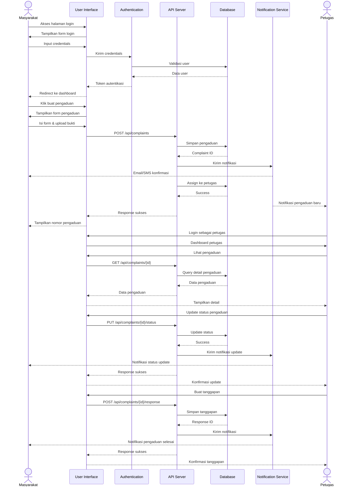
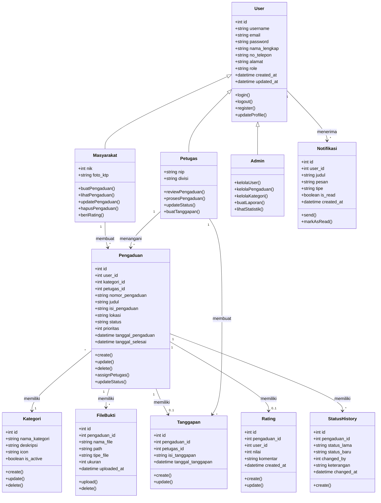

# Diagram UML Sistem Pengaduan Masyarakat (E-Government)

Dokumentasi ini berisi diagram UML untuk Sistem Pengaduan Masyarakat berbasis web menggunakan format Mermaid.

## 1. Use Case Diagram

Diagram use case menggambarkan interaksi antara aktor (pengguna) dengan sistem.

## 2. Activity Diagram

Diagram aktivitas menggambarkan alur proses untuk setiap role pengguna dalam sistem.

### 2.1 Activity Diagram - Masyarakat

Diagram aktivitas untuk role Masyarakat menggambarkan alur dari registrasi hingga memberikan feedback.

### 2.2 Activity Diagram - Petugas

Diagram aktivitas untuk role Petugas menggambarkan alur mengelola dan menanggapi pengaduan.

### 2.3 Activity Diagram - Admin

Diagram aktivitas untuk role Admin menggambarkan alur mengelola sistem, pengguna, dan laporan.

## 3. Sequence Diagram

Diagram sequence menggambarkan interaksi antar komponen sistem dalam urutan waktu.

## 4. Class Diagram

Diagram kelas menggambarkan struktur data dan relasi antar kelas dalam sistem.

## Penjelasan Diagram

### Use Case Diagram
Menampilkan tiga aktor utama:
- **Masyarakat**: Dapat mendaftar, login, membuat, melihat, update, dan hapus pengaduan
- **Petugas**: Dapat login, mengelola, menanggapi, dan mengupdate status pengaduan
- **Admin**: Dapat login, membuat laporan, mengelola pengguna dan kategori

### Activity Diagram
Menggambarkan alur aktivitas spesifik untuk setiap role pengguna:

#### Activity Diagram - Masyarakat:
1. Registrasi dan Login
2. Pembuatan pengaduan baru dengan upload bukti
3. Melihat status dan detail pengaduan
4. Update dan hapus pengaduan (jika status pending)
5. Memberikan rating untuk pengaduan selesai

#### Activity Diagram - Petugas:
1. Login dan melihat notifikasi pengaduan baru
2. Review dan validasi pengaduan
3. Update status pengaduan (pending, diproses, selesai, ditolak)
4. Membuat tanggapan untuk pengaduan selesai
5. Mengelola pengaduan yang di-assign

#### Activity Diagram - Admin:
1. Login dan melihat statistik sistem
2. Mengelola pengguna (CRUD untuk Masyarakat, Petugas, Admin)
3. Mengelola kategori pengaduan (CRUD)
4. Mengelola dan assign pengaduan ke petugas
5. Membuat laporan (by status, kategori, kinerja petugas)
6. Melihat statistik detail dengan chart dan grafik

### Sequence Diagram
Menunjukkan interaksi antar komponen:
- User Interface
- Authentication Service
- API Server
- Database
- Notification Service
- Interaksi antara Masyarakat dan Petugas

### Class Diagram
Struktur data sistem meliputi:
- User dan inheritance (Masyarakat, Petugas, Admin)
- Pengaduan sebagai entitas utama
- Supporting entities (Kategori, FileBukti, Tanggapan, Rating, dll)
- Relasi antar kelas dengan kardinalitas
