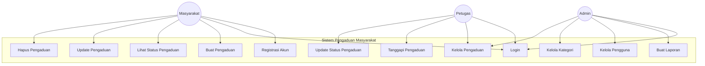
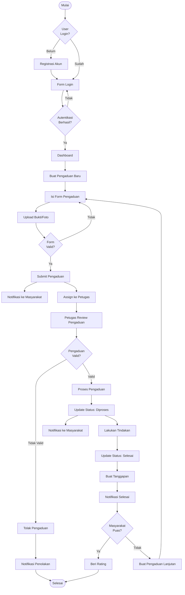
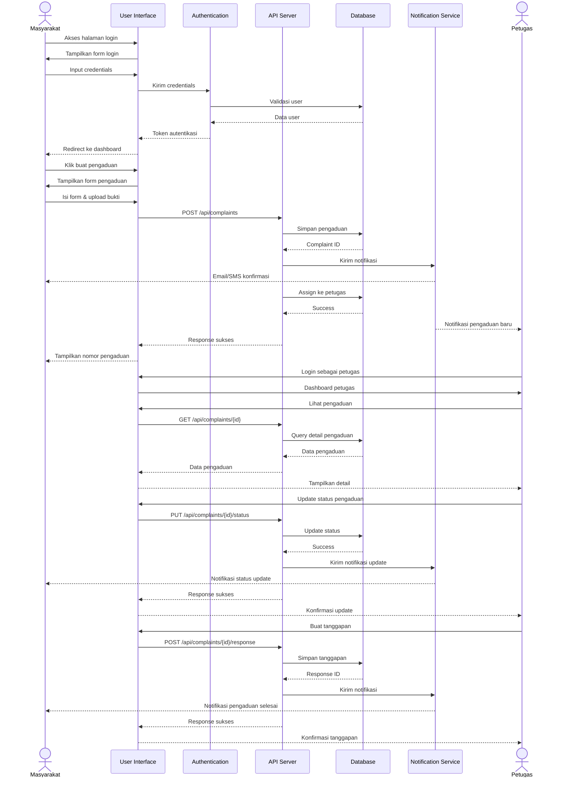
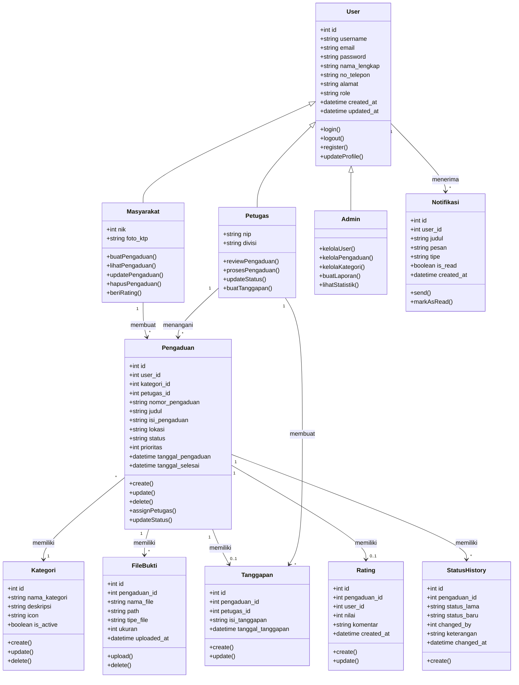

# Diagram UML Sistem Pengaduan Masyarakat (E-Government)

Dokumentasi ini berisi diagram UML untuk Sistem Pengaduan Masyarakat berbasis web menggunakan format Mermaid.

## 1. Use Case Diagram

Diagram use case menggambarkan interaksi antara aktor (pengguna) dengan sistem.

## 2. Activity Diagram

Diagram aktivitas menggambarkan alur proses pengajuan dan penanganan pengaduan.

## 3. Sequence Diagram

Diagram sequence menggambarkan interaksi antar komponen sistem dalam urutan waktu.

## 4. Class Diagram

Diagram kelas menggambarkan struktur data dan relasi antar kelas dalam sistem.

## Penjelasan Diagram

### Use Case Diagram
Menampilkan tiga aktor utama:
- **Masyarakat**: Dapat mendaftar, login, membuat, melihat, update, dan hapus pengaduan
- **Petugas**: Dapat login, mengelola, menanggapi, dan mengupdate status pengaduan
- **Admin**: Dapat login, membuat laporan, mengelola pengguna dan kategori

### Activity Diagram
Menggambarkan alur lengkap dari:
1. Login/Registrasi
2. Pembuatan pengaduan
3. Validasi dan assignment ke petugas
4. Review dan proses pengaduan
5. Penyelesaian dan feedback

### Sequence Diagram
Menunjukkan interaksi antar komponen:
- User Interface
- Authentication Service
- API Server
- Database
- Notification Service
- Interaksi antara Masyarakat dan Petugas

### Class Diagram
Struktur data sistem meliputi:
- User dan inheritance (Masyarakat, Petugas, Admin)
- Pengaduan sebagai entitas utama
- Supporting entities (Kategori, FileBukti, Tanggapan, Rating, dll)
- Relasi antar kelas dengan kardinalitas
